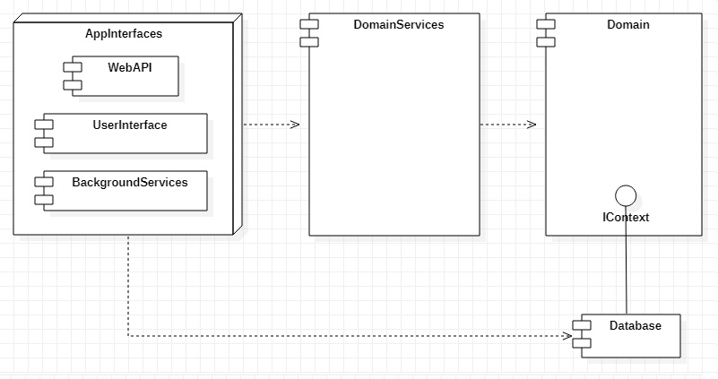

<h1>RateService</h1>
<h3>Brief</h3>

The project aim is to consolidate theoretical knowledge in software arhitecure development after reading the Martin's book <b>"Clean Architecture"</b>.

Just realised the pros of onion architecturing style. Going to applicate it to some further projects where it will be appropriate.

<h3>Current architecture</h3>

  The main idea of this architecture is independency of domain from implementation details.
  Currently interface IContext is defined in Domain and Database contains MongoContext implementing this interface. Due to DI Domain doesn't know what implementation of IContext it uses. That's why it would be quite easy to change MongoDb to MySQL for example.
  Moreover different application interfaces can inject different implementations of IContext. For example, WebAPI can use MongoContext while BackgroundServices are injecting PostgreContext (not speaking about reasons to do this way).

<h3>Further plans</h3>

Upcoming plans include:

<ul>
  <li>adding tests for background services;</li>
  <li>moving Mediatr from DomainServices to gain possibility to change the implementation of CQRS part;</li>
  <li>sticking all implementation of injected instruments (such as Mongo, Mediatr) to single project. It will simplify dependencies for existing ApplicationInterfaces.</li>
</ul>
<h3>Summary</h3>

  Architecture development is a very interesting part of Software Engineering.
  It's worth to understand the advantages and disadvantages of each concrete achitecture style before chosing it for a new project.

 
